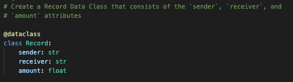
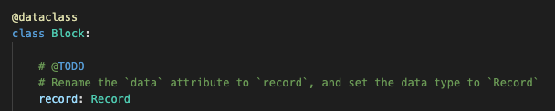
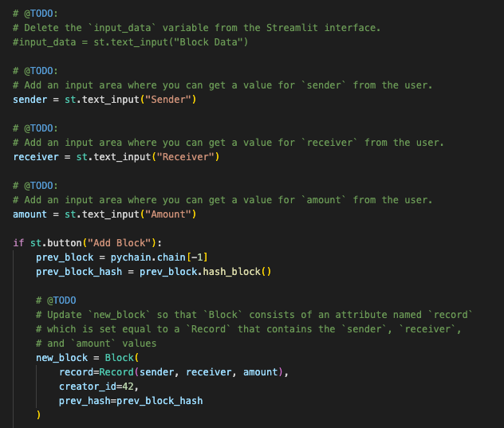
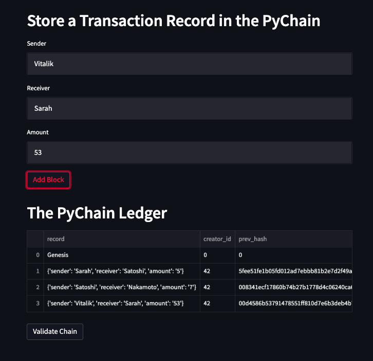
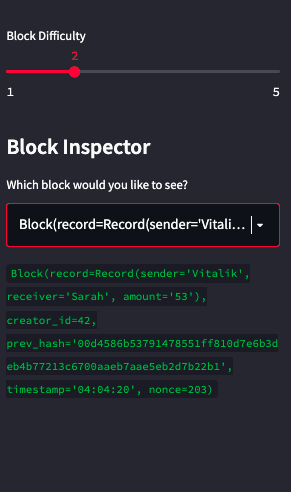

# Unit 18 Assignment - PyChain Ledger

## Task Summary
The main tasks required are as follows:
1. Create a new data class named `Record`. 
2. Modify the existing `Block` data class to store `Record` data.
3. Add Relevant User Inputs to the Streamlit interface.
4. Test the PyChain Ledger by Storing Records.

---

## Step 1: Create a Record Data Class

### Step 2: Modify the Existing Block Data Class to Store Record Data

### Step 3: Add Relevant User Inputs to the Streamlit Interface

### Step 4: Test the PyChain Ledger by Storing Records

Enter values for the sender, receiver, and amount, and then click the Add Block button. Do this several times to store several blocks in the ledger.

Test the blockchain validation process by using the web interface. 

